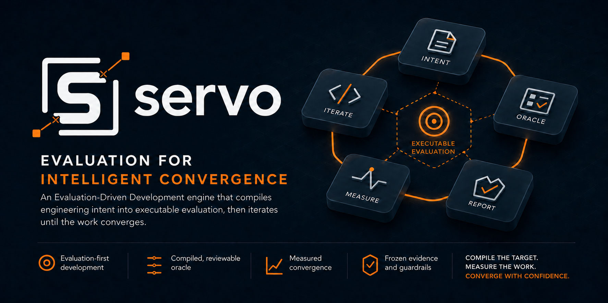

> A Claude Code and Codex evaluation layer that turns engineering intent into executable evidence.

**servo** (noun): a feedback system that measures an outcome against a target
and adjusts until they converge.

## Why Servo

AI agents can produce code faster than teams can define and repeatedly judge
“done.” Projects end up rebuilding the same machinery: acceptance checks,
scoring, retry loops, budget limits, and evidence collection.

Servo makes the target executable first. It compiles approved intent and the
signals already present in a project into evaluation that humans, CI, or agents
can run consistently. Autonomous execution is optional; the evaluation remains
the source of truth.

## What it does

Goal or criteria → reviewed evaluation → `oracle.sh` → guarded execution → evidence

- Turn a goal into reviewed, human-approved evaluation criteria.
- Decide whether work is suitable for unattended evaluation.
- Compile project signals and acceptance criteria into an executable oracle.
- Author frozen deterministic and model-judged evaluation components.
- Run quality gates or guarded implementation loops.
- Schedule read-only discovery and oracle-gated follow-up work.

## Principles Servo encodes

- **Evaluation before execution.** Define and approve success before optimizing
  an implementation toward it.
- **Humans own intent.** Servo may propose criteria, but it never silently turns
  generated criteria into product truth.
- **Project-owned evidence.** The project controls its `oracle.sh`, durable
  evaluation artifacts, and evaluation policy.
- **Guardrails are executable.** Missing prerequisites, budget exhaustion, and
  inconclusive evidence produce explicit outcomes instead of optimistic passes.
- **Runtimes are interchangeable.** Humans, CI, Claude Code, Codex, or Servo’s
  optional loop can consume the same evaluation.

See the [product vision](https://github.com/ramboz/servo/blob/main/docs/product-vision.md)
for the full product framing and
[architecture](https://github.com/ramboz/servo/blob/main/docs/architecture.md)
for implementation contracts.

## Start here

Install the plugin for your host, then open a fresh session in the project you
want to evaluate.

### Install

**Claude Code plugin**

```text
/plugin marketplace add ramboz/servo
/plugin install servo@servo
```

**Codex plugin**

```bash
codex plugin marketplace add ramboz/servo
codex plugin add servo@servo
```

Optional features that invoke `claude -p`, `/goal`, or Claude `Stop` hooks
remain Claude-specific.

## Extension points

> Bring your own criteria and signals; Servo provides the evaluation harness.

- Add project-specific `score_<name>` components to the generated oracle.
- Drive evaluation from a human workflow, CI, or another execution runtime.
- Use [Jig](https://github.com/ramboz/jig) as an optional upstream workflow;
  neither plugin requires the other.

## Verifying a host install

Claude and Codex packages are generated and verified independently; one host’s
successful install does not prove the other. Maintainer verification and
release-archive procedures live in
[CONTRIBUTING.md](https://github.com/ramboz/servo/blob/main/CONTRIBUTING.md).

### From source (contributors)

Use the local host packages and the CI-equivalent gate documented in
[CONTRIBUTING.md](https://github.com/ramboz/servo/blob/main/CONTRIBUTING.md).

## Getting started

After installing, open the target project in a fresh session and say:

> Set up Servo for this project

That invokes `/servo:scaffold-init`, which inspects the project and creates a
reviewable `oracle.sh`, `.servo/install.json`, and refinement notes.

## Repository structure (for contributors)

Canonical source at the repository root generates committed, drift-guarded
packages under `hosts/claude` and `hosts/codex`. See the
[architecture](https://github.com/ramboz/servo/blob/main/docs/architecture.md)
for contracts and package topology.

## Contributing

Servo uses squash merges, conventional PR titles, a CI-equivalent local gate,
and release-please. See
[CONTRIBUTING.md](https://github.com/ramboz/servo/blob/main/CONTRIBUTING.md).

## Status

The core evaluation-compilation and guarded-execution paths are available for
Claude Code and Codex. Live capability status and sequencing are maintained in
the [roadmap](https://github.com/ramboz/servo/blob/main/docs/specs/ROADMAP.md).

## License

[MIT](https://github.com/ramboz/servo/blob/main/LICENSE)
